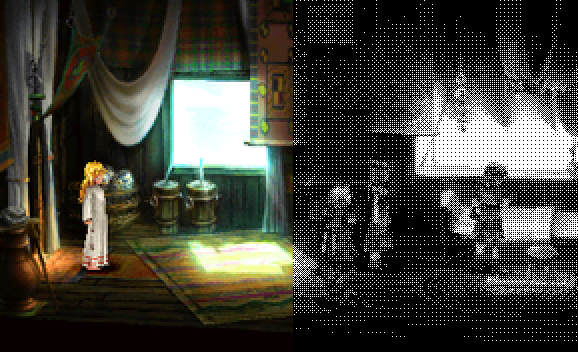

# Dither Effect Tool



## Dependencies:

* Vue 3 + TypeScript
* Vue Router
* Tailwind
* Pinia

## TODO:

1. Colored Dithering
2. Palettes (.gpl support)
3. Contrast/Brightness options
4. Resize, etc.

## Setup

```sh
npm install
```

### Compile

```sh
npm run dev
```
